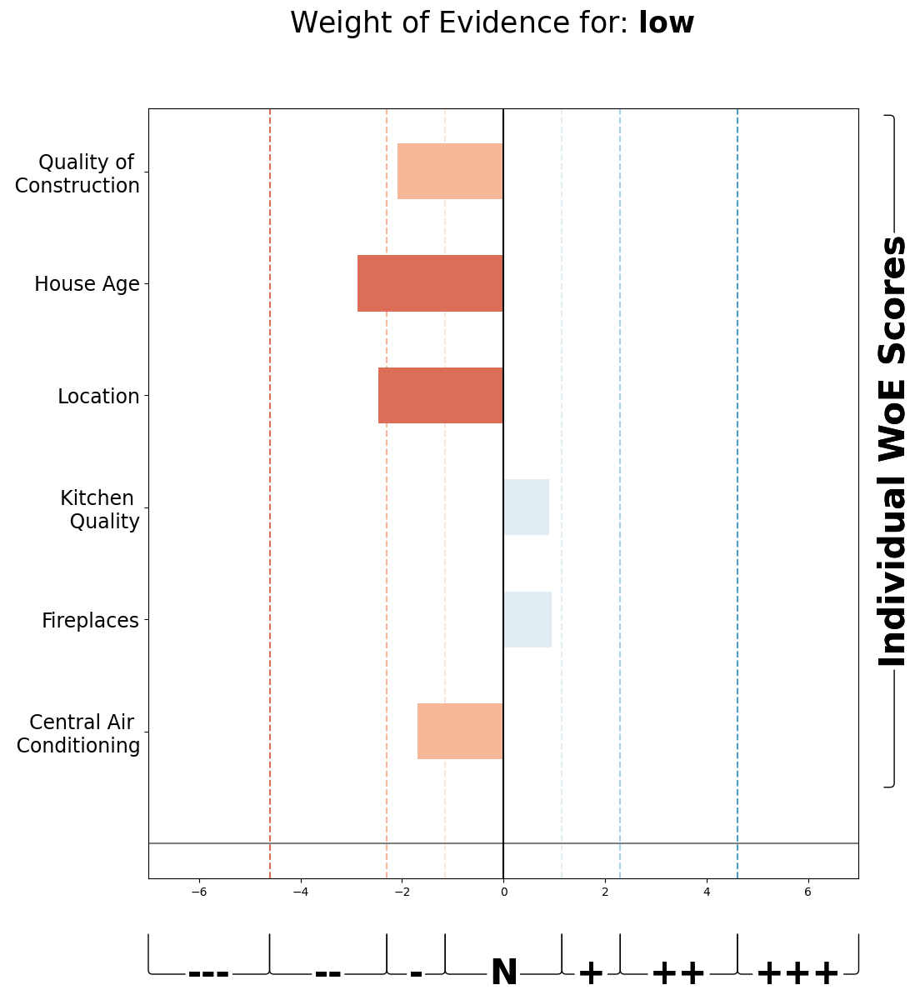
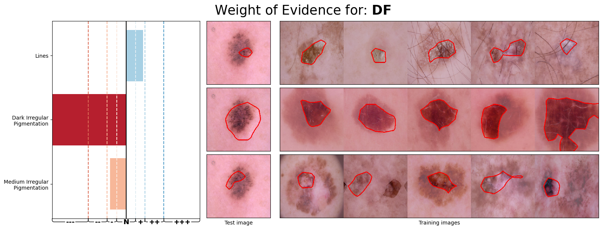

# Evaluative AI

**Evaluative AI** is a tool for decision support by providing positive and negative evidence for a given hypothesis. This tool is currently used for two types of dataset (tabular vs. image) as shown below.

1. Tabular dataset



**Figure 1: Example of tabular data analysis showing positive and negative evidence for hypothesis low**. [Paper: A Hypothesis-Driven Approach to Decision Support Using Evidence](https://arxiv.org/abs/2402.01292)

2. Image dataset



**Figure 2: Example of image data analysis showing positive and negative evidence for a skin cancer diagnosis**

This tool finds high-level human-understandable concepts (e.g., Irregular Pigmentation) in an image and generates the Weight of Evidence (WoE) for each hypothesis in the decision-making process. A full paper is under-review. A short paper for this example is here: [Visual Evaluative AI: A Hypothesis-Driven Tool with Concept-Based Explanations and Weight of Evidence](https://arxiv.org/abs/2407.04710).

## Prerequisites
### Environment
```
Python 3.10.4
CUDA 12.2.0
UCX-CUDA 1.13.1-CUDA-12.2.0
cuDNN 8.9.3.28-CUDA-12.2.0
Graphviz 5.0.0
torch 2.1.2+cu121
torchvision 0.16.2+cu121
```

### Installation
```
virtualenv ~/venvs/venv-3.10.4-cuda12.2 #create the env
source ~/venvs/venv-3.10.4-cuda12.2/bin/activate #activate the env
pip3 install torch torchvision torchaudio
pip3 install -r requirements.txt
```

## Code structure
```
datasets
├── 7-point-criteria
└── HAM10000
save_model
EvaluativeAI
├── Explainers
├── README.md
├── app.py
├── classifiers.py
├── config.py
├── eval.py
├── ice
│   ├── __init__.py
│   ├── channel_reducer.py
│   ├── explainer.py
│   ├── model_wrapper.py
│   └── utils.py
├── learn_concepts_dataset.py
├── main.py
├── pcbm
│   ├── concepts
│   │   ├── __init__.py
│   │   └── concept_utils.py
│   ├── data
│   │   ├── __init__.py
│   │   ├── concept_loaders.py
│   │   ├── constants.py
│   │   └── derma_data.py
│   └── models
│       ├── __init__.py
│       ├── derma_models.py
│       ├── model_zoo.py
│       └── pcbm_utils.py
├── pcbm_output
├── preprocessing
│   ├── cnn_backbones.py
│   ├── data_utils.py
│   ├── initdata.py
│   └── params.py
├── reproducibility
│   ├── output
│   └── script
│       ├── pretrained.sh
│       └── scratch.sh
├── requirements.txt
├── test_data
├── train_cnn.py
├── utils.py
└── woe
    ├── __init__.py
    ├── explainers.py
    ├── woe.py
    └── woe_utils.py
└── online_data
└── example-image.ipynb
└── example-tabular.ipynb
```

## Datasets
- Ames Housing Dataset: [Github Link](https://github.com/at-tan/Cracking_Ames_Housing_OLS)
- HAM10000 dataset: Skin lesion classification dataset - [Kaggle Link](https://www.kaggle.com/datasets/kmader/skin-cancer-mnist-ham10000)
- Derm7pt: Dermatology concepts dataset - [Link](https://derm.cs.sfu.ca/Welcome.html)

Please put the datasets in the right folder followed the code structure above.

## Usage

### Reproducibility
To reproduce the results in the paper [Visual Evaluative AI: A Hypothesis-Driven Tool with Concept-Based Explanations and Weight of Evidence](https://arxiv.org/abs/2407.04710), please either use pre-trained models or train from scratch as described below. Then, run `python eval.py` to see the results.

#### Use pre-trained models
- Available pre-trained models [Download](https://doi.org/10.5281/zenodo.11205936)
    + Pre-trained CNN backbones Resnet50, ResneXt50 and Resnet152: in the folder `save_model` 
    + Pre-trained concept models ICE, PCBM: pickle files in the folder `Explainers`
    + Pre-trained concept bank for PCBM: in the folder `pcbm_output`
- Please refer to `reproducibility/script/pretrained.sh` for the training using pre-trained models above

#### Train from scratch
- Step by step to train from scratch
    + Train the CNN backbone model
    + For unsupervised learning concept, train the concept model ICE
    + For supervised learning concept, we first need to train the concept bank using the 7pt checklist dataset, then train the concept model PCBM using the HAM10000 dataset
- Please refer to `reproducibility/script/scratch.sh` for training from scratch

### Run the app
Before running the app, please download the `for_app.zip` [Download](https://doi.org/10.5281/zenodo.11205936) and follow the code structure to put them in the right place.

```
# Use an unsupervised learning concept model (ICE)
python app.py --algo ice

# Use a supervised learning concept model (PCBM)
python app.py --algo pcbm
```

## References
- [WoE package](https://github.com/dmelis/interpretwoe)
- [ICE package](https://github.com/zhangrh93/InvertibleCE)
- [PCBM package](https://github.com/mertyg/post-hoc-cbm)
